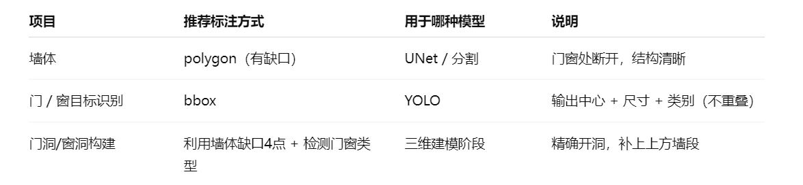

# DeepLearning

demo1: 住宅户型识别与重建

yolov8 微调简单识别
unet 语义分割联合 yolov8
墙体需要像素级标注与生成，墙体数据与识别的准确性是重要基础。
其它品类生成均需要墙体端点坐标作为基础，比如门洞，
以墙体端点缺口为基础结合目标检测门窗图例确定门洞或窗洞识别与位置，
以该缺口位置的墙体 4 个端点作为水平坐标，拉伸生成门洞上方墙体，
比如地面与天花，需要外墙端点坐标。
DEMO 户型识别训练数据选 2 类：L 家与线图无家具，DEMO 三维生成不用考虑家具
，只需要：天花、地面、墙体、门洞、窗洞。

1、数据增强；2、模型选型优化；3、标注优化；4、训练参数优化；

参考文献
https://mp.weixin.qq.com/s/qVrn4UyAHXG9-R1GlgqZIA
<video controls src="4a0c0499efa6400e73258b367eac49e0.mp4" title="Title"></video>
